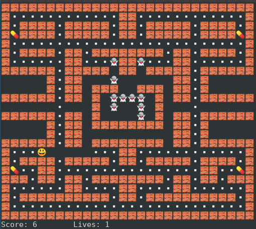

# Pac Rust

A PacMan game implemented in Rust.



## About

This project follows the different steps describe in [Pac Go](https://github.com/danicat/pacgo): a tutorial project to learn Go programming language.

## How to run ?

Use the following command to run the PacMan game:

```
cargo run
```

You can use the arrow keys to move the player and the `ESC` key to quit the game.